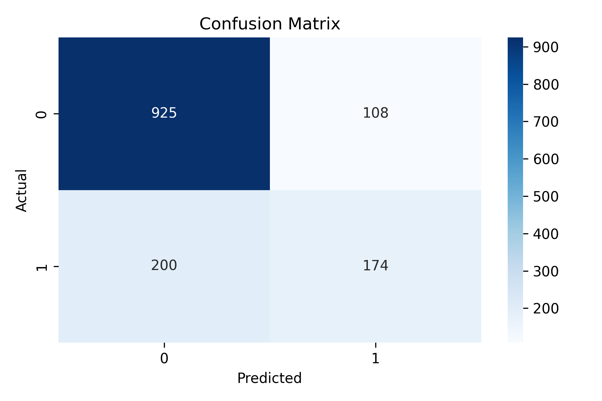
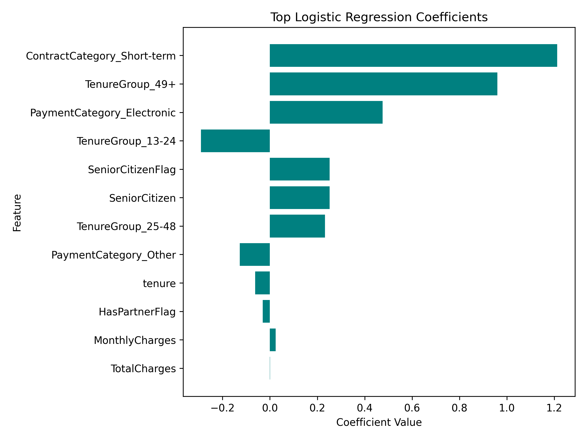
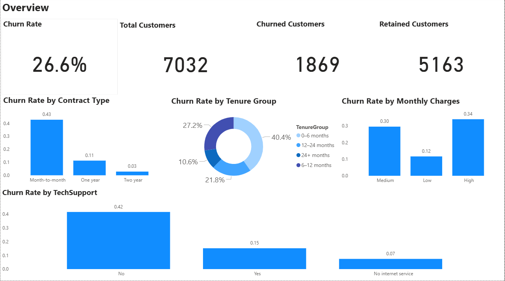

# 🌐 Telco Customer Churn Analytics  
### *End‑to‑end analytics using SQL, Python, and Power BI*

---

## 🏷️ Tech Stack  

---

## 📘 Project Overview  
This project analyses customer churn for a telecom provider using a complete analytics workflow:

- **SQL** for feature engineering  
- **Python** for modelling and evaluation  
- **Power BI** for interactive visualisation  
- **Business insights** for strategic recommendations  

The objective: understand *why* customers churn and *how* the business can reduce it.

---

# 📊 Churn Insights Summary  

## 🔍 Customer Churn Insights Overview  
The Telco Customer Churn dataset reveals clear behavioural, financial, and service‑level patterns that differentiate customers who stay from those who leave.

---

## 💰 1. Financial Drivers  
- Churners pay significantly higher MonthlyCharges (≈ £74 vs £61).  
- Churners have much lower TotalCharges, indicating early‑life churn.  
- Price sensitivity and dissatisfaction are major triggers.

---

## ⏳ 2. Tenure and Contract Behaviour  
- Customers with short tenure churn at much higher rates.  
- Month‑to‑month contracts show the highest churn.  
- One‑ and two‑year contracts are far more stable.

---

## 🌐 3. Internet Service Type  
- Fiber optic customers churn the most (≈ 42%).  
- DSL customers churn far less (≈ 19%).  
- No‑internet customers churn the least (≈ 7%).

---

## 🛟 4. Support and Security Services  
- Customers without TechSupport churn at nearly 3× the rate of those with it.  
- The same pattern appears for OnlineSecurity.  
- Support services reduce confusion and dissatisfaction.

---

## 💳 5. Payment Method  
- Electronic check users churn the most (≈ 45%).  
- Automatic payments have the lowest churn (≈ 15–17%).  
- Billing friction contributes to churn.

---

## 🧩 Overall Churn Narrative  
Churners tend to be:

- Early‑tenure  
- Paying higher monthly fees  
- Using complex services (fiber optic)  
- Lacking support/security add‑ons  
- Paying through friction‑heavy methods  

Retained customers tend to be:

- Long‑tenure  
- On stable contracts  
- Using simpler or cheaper services  
- Supported by TechSupport/OnlineSecurity  
- Enrolled in automatic payments  

---

## 💼 Business Implications  
- Improve onboarding for new high‑speed customers.  
- Offer bundled support/security services.  
- Encourage automatic payments.  
- Target early‑tenure customers with retention messaging.  
- Review pricing for premium service customers.  

---

# 🧠 Modelling & Key Insights (Logistic Regression)

## 🧮 Model Overview  
A Logistic Regression model was used to quantify how customer attributes influence churn probability.  
It was trained on SQL‑engineered features and encoded in Python.

---

## 📦 Feature Set Used  

**Continuous variables**  
- tenure  
- MonthlyCharges  
- TotalCharges  

**Engineered binary flags**  
- SeniorCitizenFlag  
- HasPartnerFlag  

**Encoded categorical features**  
- ContractCategory_*  
- PaymentCategory_*  
- TenureGroup_*  

---

## 📉 Coefficient Interpretation  
- Positive coefficient → increases churn risk  
- Negative coefficient → decreases churn risk  
- Larger magnitude → stronger effect  

---

## 🔥 Top Churn Drivers  
- Short‑term contracts (+1.21)  
- Long‑tenure customers, 49+ months (+0.96)  
- Electronic payment method (+0.48)  
- Senior customers (+0.25)  
- Tenure 25–48 months (+0.23)  

---

## 🌱 Retention Signals  
- TenureGroup 13–24 months (–0.29)  
- Stable payment methods (–0.13)  
- Tenure (continuous) (–0.06)  
- HasPartnerFlag (–0.03)  

---

# 📈 Model Evaluation  

The Logistic Regression model achieved an overall accuracy of **78%**.

### **Classification Report**  
- Accuracy: 0.78  
- Precision (Churn): 0.62  
- Recall (Churn): 0.47  
- F1‑Score (Churn): 0.53  

---

## 📉 Confusion Matrix (Visual)  

### Interpretation  
- **925** true negatives  
- **174** true positives  
- **108** false positives  
- **200** false negatives  

The model captures meaningful churn patterns but misses some churners — a common challenge in churn modelling.

---

## 🧠 Feature Importance (Visual)  

---

# 📊 Power BI Dashboard  

### Dashboard Preview  

👉 **View the full Power BI dashboard here:**  
🔗 https://github.com/oseghwajoana-cmd/telco-churn-powerbi-dashboard

The dashboard includes:

- Customer segmentation  
- Churn breakdown by demographics, services, and contract types  
- High‑risk customer profiles  
- Interactive filters for deeper exploration  
- Visualisation of key churn drivers  

---

📁 Repository Structure
project/
│
├── data/                     # Raw dataset
├── model/                    # Python modelling notebook
├── sql/                      # SQL feature engineering scripts
├── images/                   # Visuals used in README
└── README.md                 # Project documentation

